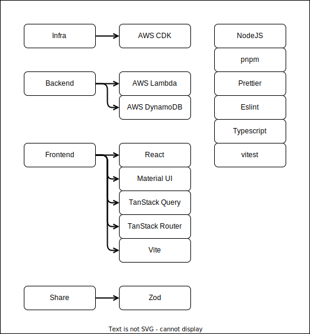

# Bots

This project is a coding practice repository.

[Demo application](https://d2rkgbbcg9kjjb.cloudfront.net)

## Setup

- [Setup node](https://nodejs.org/en)
- [Setup pnpm](https://pnpm.io/installation)
- [Setup AWS CLI](https://docs.aws.amazon.com/cli/latest/userguide/cli-chap-getting-started.html)

Install dependencies.

```bash
pnpm i
```

When deploying to AWS, make sure you are logged in AWS CLI.

```bash
aws sso login
```

Run only once per AWS account

```bash
pnpm setup
```

esbuild is installed in the root package following a [recommendation from aws cdk](https://docs.aws.amazon.com/cdk/api/v2/docs/aws-cdk-lib.aws_lambda_nodejs-readme.html#local-bundling).

Vitest is installed in the root for better compatibility with vs code plugin.

## Deploy

Deploy in the default region on the logged AWS account.

The URL of the application will be in the output of the command at the end.

```bash
pnpm run deploy
```

## Test

```bash
pnpm test
```

## Stack

The setup is going to be an updated and modified version of my sample project https://github.com/fcostarodrigo/sample-project.



## Wire frame


## Domain


### Bot Data Model

A Bot definition looks like this

```json
{
  "botId": "04140c19-0c46-43c6-8e78-f459cd3b3370",
  "name": "Bot One",
  "description": "First Bot",
  "status": "DISABLED", // DISABLED, ENABLED or PAUSED
  "createdAt": 1713809849892,
  "updatedAt": 1713773401591
}
```

### Worker Data Model

A Worker definition looks like this

```json
{
  "workerId": "6f4fdfd9-da33-4711-9386-579e8101dc43",
  "name": "Worker One",
  "description": "First Worker",
  "botId": "04140c19-0c46-43c6-8e78-f459cd3b3370",
  "createdAt": 1713773401591,
  "updatedAt": 1713773401591
}
```

### Log Data Model

A Log definition looks like this

```json
{
  "logId": "a3922ad6-49ed-4cf3-8293-cc4d58a5d4c9",
  "message": "Some Message",
  "botId": "44700aa2-cba6-43d2-9ad4-8d8a499bd356",
  "workerId": "e5d7874c-fd2d-41b8-abc1-2e311964ae8c",
  "createdAt": 1713773401591,
  "updatedAt": 1713773401591
}
```
