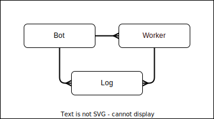

# Bots

This project is a coding practice repository designed to enhance programming skills.

## Stack

The setup is going to be an updated and modified version of my sample project https://github.com/fcostarodrigo/sample-project.


## Wire frame


## Domain



### Bot Data Model

A Bot definition looks like this

```json
{
  "id": "04140c19-0c46-43c6-8e78-f459cd3b3370", // Immutable Required UUID
  "name": "Bot One", // Mutable Required String
  "description": "First Bot", // Mutable Optional String
  "status": "DISABLED", // Mutable Required String Enum ["DISABLED", "ENABLED", "PAUSED"]
  "created": 1713809849892 // Immutable Required Epoch Timestamp
}
```

### Worker Data Model

A Worker definition looks like this

```json
{
  "id": "6f4fdfd9-da33-4711-9386-579e8101dc43", // Immutable Required UUID
  "name": "Worker One", // Mutable Required String
  "description": "First Worker", // Mutable Optional String
  "bot": "Bot One", // Mutable Required String - references a unique bot
  "created": 1713773401591 // Immutable Required Epoch Timestamp
}
```

### Log Data Model

A Log definition looks like this

```json
{
  "id": "a3922ad6-49ed-4cf3-8293-cc4d58a5d4c9", // Immutable Required UUID
  "created": "2024-04-22T14:14:14.926Z", // Immutable Required ISO Timestamp
  "message": "Some Message", // Mutable Required String
  "bot": "44700aa2-cba6-43d2-9ad4-8d8a499bd356", // Immutable Required UUID - references a unique bot
  "worker": "e5d7874c-fd2d-41b8-abc1-2e311964ae8c" // Immutable Required UUID - references a unique worker
}
```
